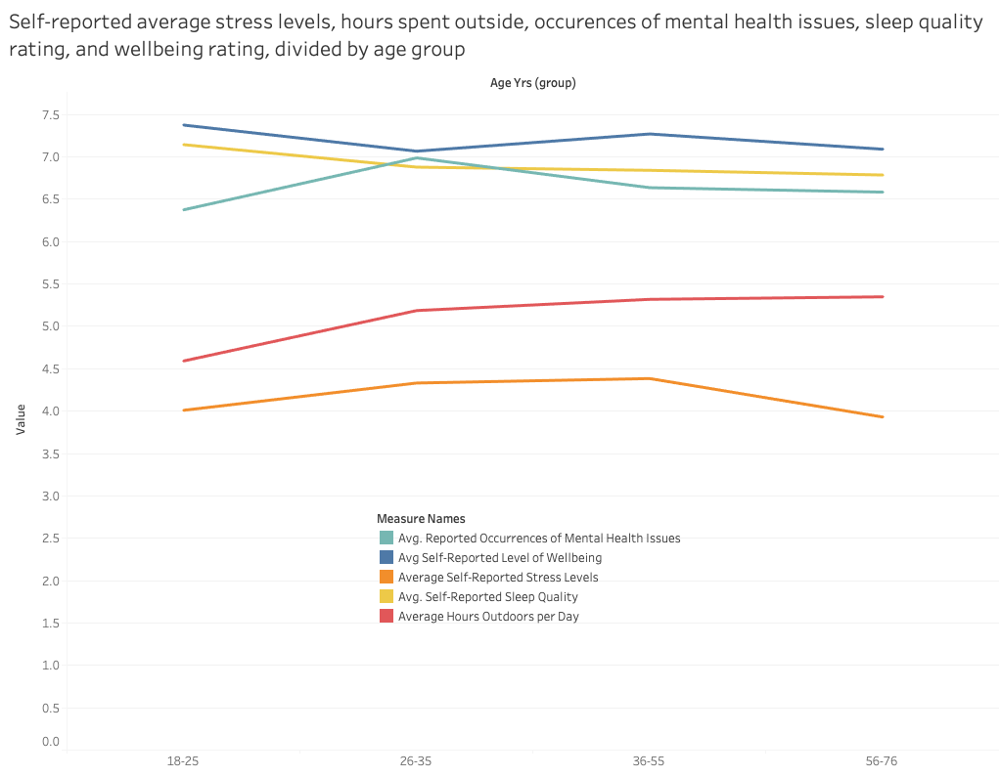
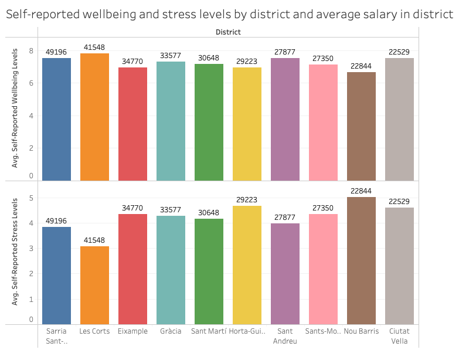
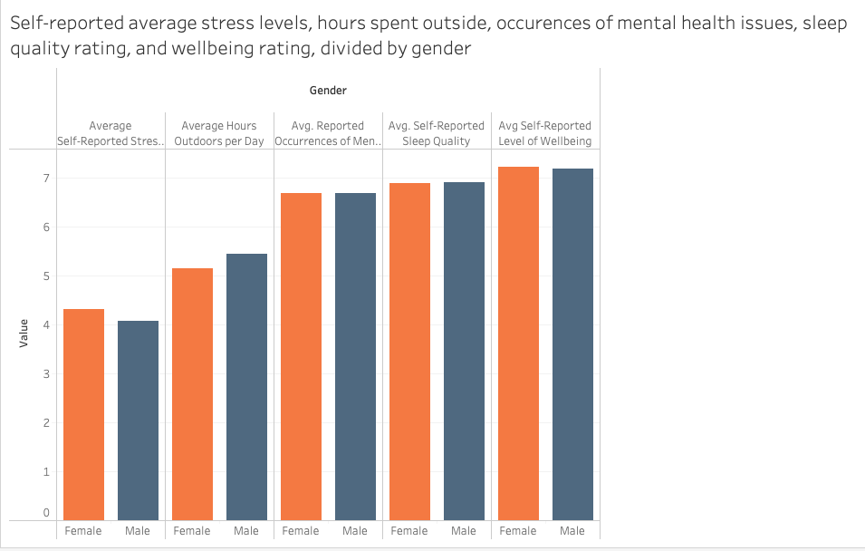
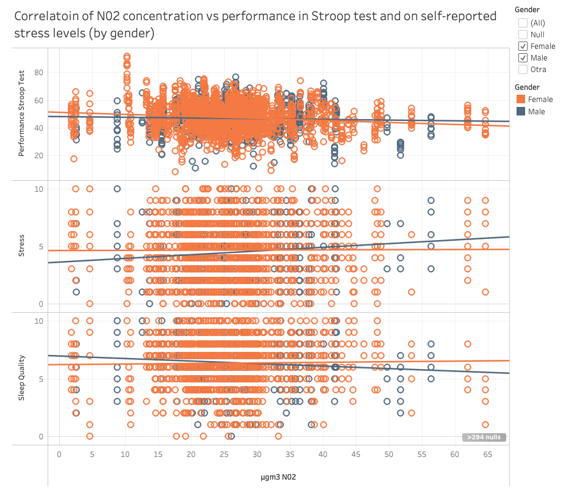
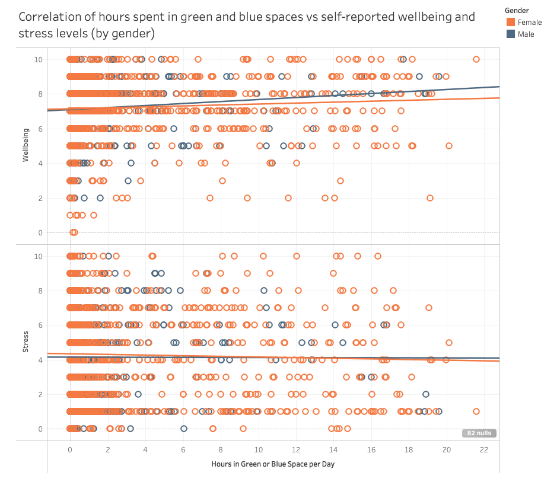
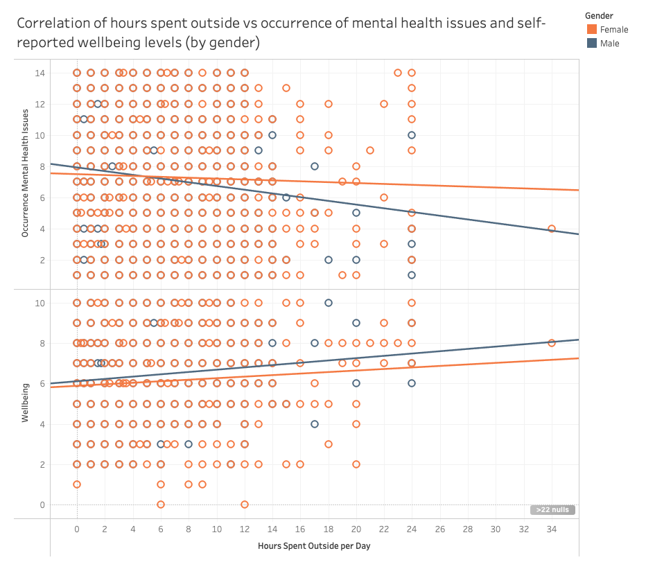

# Project IV - Data Analysis on the Potential Effects of Air Pollution on Mental Health in Barcelona #

## Edward Rodger Martinez - Ironhack ##

Link to Tableau Story: 

https://public.tableau.com/views/EduProjectIV/Story1?:language=en-GB&:display_count=n&:origin=viz_share_link

### Overview ###

This is a Data Analytics project using a database from a scientific paper titled 'Short-term NO2 exposure and cognitive and mental health: A panel study based on a citizen science project in Barcelona, Spain', which is an EU Commission-funded research project, as part of the project titled 'CitieS-Health – Citizen Science for Urban Environment and Health'. 

The study this project is based on consists of having citizens in Barcelona fill in surveys on a daily basis for 2 weeks about their mental health (mostly ranking things from 1-10), as well as lifestyle questions or questions about the amount of time they spend outdoors or in a park each day. The research team then uses various methods to capture information such as N02 levels or noise levels in the district or GPS location where the participant is, or in Barcelona in general. 

The goal of my project is to use the data available to conduct specific lines of research and ask specific questions about the reltionship between air quality, green space, and mental health in Barcelona.

### Requirements and Libraries ###

Code was written in Python on Jupyter Notebook and Visual Studio Code. Tableau was used for visualisations. The following libraries were used:

Pandas
Numpy
OS 
Getpass
Sqlalchemy

### Workflow ###

The database was clean but very large, so step 1 was to choose the information I wanted to work with and make a subset. For variables such as N02 exposure or noise pollution, the original study was very in-depth and used different weighted variables for each (such as N02 exposure at GPS location, in Barcelona, over 12h, or 25h). Here is a brief explanation of why I chose the following columns: 

Occurrence of mental health issues; wellbeing (bienestar); stress (estres); sleep quality (sueño); hours spent outdoors (horasfuera); illness (enfermo) - these seemed like the best ones to give a general overview of wellbeing and mental/physical health. For brevity I excluded other variables such as lifestyle choices like smoking or taking drugs.

Performance - this refers to the participants' performance in a cognitive test called the Stroop Test. There were many different measures for this (including reaction time or weighted scores), but this seemed like the most straightforward. 

μgm3 - this refers to micrograms cubed of N02 in the atmosphere as recorded by a device the participants carried on them during the 2-week study. I chose this as the most accurate reflection and because it was the simplest to work with, compared to the N02 levels as measured through other means (generally in the city, at the GPS location or in the district)

Access to green/blue spaces within 300m; seconds of noise over 55 mins in a day; hours in green/blue spaces per day - I chose these 3 variables to explore other factors rather than just N02 exposure. 

District; Age; Gender - including these variables allowed me to look at whether any of the patterns I found changed or were reinforced when looking at age, gender or district of Barcelona. 

To finish the preparation of the dataset, I added a column showing the mean salary in each district. This was to include a socio-economic dimension to my findings - for example, were people from a lower-income district reporting higher levels of stress, lower levels of wellbeing?

After preparting the dataset, I used SQL queries to explore how the data looks when divided by age groups, gender, and district. The findings of these queries guided some of the visualisation. 

Finally, I used Tableau to visualise the results. The visualisations are mostly composed of scatter plots due to the high amount of numerical variables involved.

### Limitations ###

Firstly, this database is part of an in-depth, rigorous scientific study, so it is possible that in my selection of variables the data and its interpretations have been overly-simplified. 

Secondly, comparisons on gender should be taken with a pinch of salt due to the much higher proportion of women taking part in the survey. 

Lastly, the database and reseach behind it is intended to explore short-term mental health effects of exposure to pollution - the changes we see in mood, sleep, wellbeing etc are small changes, since the timeline of the study is short. The correlations we look at are therefore smaller than they would be for another type of study (for example, correlation between smoking and long-term probability of getting lung cancer). 

### Introduction ###

This project will first focus on 3 possible biases in the data - these are the age and gender of the study participants, as well as the district of Barcelona in which they live. The purpose of this initial phase is to assess whether the study, which aims to show possible short term effects of air quality and green space on mental health, is affected by these biases - for example, if people in wealthier neighbourhoods are generally less likely to report high levels of stress.

Having explored these biases, the project then focusses on the possible conclusions the study makes - these look at the effects of N02 concentration, hours spent in green and blue spaces, and hours spent outside, on participants' mental health. 

### Age & District ###

The first tableau dashboard shows 2 graphs - these are intended to explore whether the responses to the mental health survey changed significantly when looking at different age groups or different districts. 

For age, there seems to be no significant change. This means that on average, older people or younger people in this database were not reporting more or less 'optimistically'. One conclusion I thought I might find from this as that younger people are more likely to report mental health issues such as anxiety, but this does not seem to be the case. 

For district, I arranged the bars for each district in order of 'richest' to 'poorest' districts, based on average salary in each district. I noticed 2 things; 

The 2 'richest' districts, Sarriá-San Gervasi and Les Corts, reported the highest wellbeing levels on average.

These neighbourhoods also reported the lowest levels of stress on average, while the 2 'poorest' (Nou Barris and Ciutat Vella) reported some of the highest average stress levels.

Of course, this touches on the important topic of the socio-economic roots of mental health. 

### Gender ###

This bar plot shows that while overall the average responses of men and women in this survey are quite similar, there are some exceptions; women on average reported higher stress levels, and men reported more time spent outside. 

While comparing genders in this study is difficult due to the large majority of the participants being women, I chose to highlight this as it shows interesting avenues to take this kind of research into next steps. For example, do gender imbalances in domestic labour have effects on how often women or men go outside?

### N02 Concentration ###

Having looked at these biases, we can now get into some of the study's conclusions. To do this, I looked at the correlation between different variables in the dataset. I noticed 3 areas of the study with a noticeable correlation. The first was the N02 concentration vs Stroop test performance, stress leves and sleep quality.

In order to assess whether the differences mentioned earlier in gender were reflected in these visualisations, I added gender as the hue variable.

As we can see, a higher concentration of N02 is lightly correlated to: 

Lower performance in the Stroop test (especially for women)

Higher reported stress levels among men

Lower reported sleep quality among men

### Hours Spent in Green and Blue Spaces ###

Another area with a noticeable correlation was number of hours spent in green/blue spaces vs reported wellbeing and stress levels;

As we can see from the scatter plot, more hours spent in green and blue spaces, is correlated to: 

Higher levels of reported wellbeing (especially for men)

Lower levels of stress (especially for women)

### Hours Spent Outside ###

Finally, the correlation between number of hours spent outdoors, and occurrence of mental health issues and reported wellbeing, is also noteworthy.

As is visible from the light correlation in the scatter plot, more hours spent outside is correlated to: 

Lower occurrence of mental health issues (especially for men)

Higher levels of wellbeing (especially for men)

### Conclusions ###

There are socio-economic and gendered differences in some areas of self-reported mental health which are worth studying further. 

Higher concentrations of N02 may have adverse effects on short-term cognitive health and sleep quality, whilst increasing stress levels. 

More time spent outdoors, and especially in green and blue spaces, may increase wellbeing and lower stress and occurrence of mental health issues. 